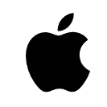
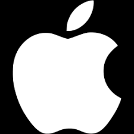

# 🍎 Apple Website Clone

This project is a **frontend clone of the Apple website**, built using **HTML, CSS, and Vanilla JavaScript**.  
A key highlight of this project is a **custom Apple logo created manually using Bézier curves and rendered on an HTML Canvas**.

## 🚀 Features

- Apple-style navigation bar
- Fully responsive layout (desktop & mobile)
- **Custom Apple logo drawn using Bézier curves on HTML Canvas**
- Interactive color picker to dynamically change the logo color
- Multiple landing sections (iPhone, Watch, Footer)
- Clean and well-structured frontend code

## 🛠️ Technologies Used

- **HTML5**
- **CSS3**
- **JavaScript (Vanilla JS)**
- **HTML Canvas API**
- **SVG & Bézier Curves**

## 🎨 Custom Canvas Logo (Bezier Curves)

The Apple logo displayed on the page is **not an image or SVG file**.  
It is **manually drawn using Bézier curves (`bezierCurveTo`) on an HTML Canvas**, demonstrating:

<table>
  <tr>
    <td align="center"><strong>Bezir</strong></td>
    <td align="center"><strong>SVG</strong></td>
    <td align="center"><strong>PNG</strong></td>
  </tr>
  <tr>
    <td align="center"></td>
    <td align="center"></td>
    <td align="center"></td>
  </tr>
</table>

The logo color can be changed in real time using an interactive color picker.

